# Aplicativo de Solicitudes de Alianzas — Guía para Negociadores

Este documento describe el flujo completo del aplicativo interno de solicitudes entre **Negociación** y el **Área de Alianzas**, desde el punto de vista del negociador.

El aplicativo permite:

1. **Subir una solicitud** al área de alianzas a partir de las deudas de un cliente (Formulario de Alianzas).
2. **Consultar las solicitudes enviadas** y su estado (Ver Mis Solicitudes).

El documento se divide en dos grandes secciones que corresponden a estas dos funcionalidades. La pestaña "Resumen de Solicitudes" de la vista de consulta **no se aborda** en este documento.

---

## Contenido

- [1. Subida de Formulario](#1-subida-de-formulario)
  - [1.1 Paso 1: Referencia del Cliente](#11-paso-1-referencia-del-cliente)
  - [1.2 Paso 2: Búsqueda y validación de las deudas](#12-paso-2-búsqueda-y-validación-de-las-deudas)
  - [1.3 Paso 3: Características del Cliente](#13-paso-3-características-del-cliente)
  - [1.4 Paso 4: Selección de deudas](#14-paso-4-selección-de-deudas)
  - [1.5 Paso 5: Tipo de Solicitud y Aliado](#15-paso-5-tipo-de-solicitud-y-aliado)
  - [1.6 Paso 6: Montos propuestos por deuda](#16-paso-6-montos-propuestos-por-deuda)
  - [1.7 Monto recomendado](#17-monto-recomendado)
  - [1.8 Alertas y verificaciones](#18-alertas-y-verificaciones)
  - [1.9 Paso 7: Especificaciones del Acuerdo de Pago](#19-paso-7-especificaciones-del-acuerdo-de-pago)
  - [1.10 Comentarios adicionales](#110-comentarios-adicionales)
  - [1.11 Paso 8: Resumen y envío de la solicitud](#111-paso-8-resumen-y-envío-de-la-solicitud)
- [2. Vista de Respuestas (Ver Mis Solicitudes)](#2-vista-de-respuestas-ver-mis-solicitudes)
  - [2.1 Filtros](#21-filtros)
  - [2.2 Vista de solicitudes paginadas](#22-vista-de-solicitudes-paginadas)
  - [2.3 Contenido de cada solicitud (expander)](#23-contenido-de-cada-solicitud-expander)
- [3. Glosario de estados de solicitud](#3-glosario-de-estados-de-solicitud)

---

# 1. Subida de Formulario

La página de subida se llama **"Formulario Alianzas"** y su encabezado es "Nuevo Formulario de Alianzas". Es un formulario guiado paso a paso, en el que el sistema valida cada sección antes de permitir continuar.

## 1.1 Paso 1: Referencia del Cliente

La primera sección solicita la identificación del cliente:

- **Referencia del Cliente** (campo numérico, obligatorio): se ingresa la referencia del cliente, por ejemplo `3007083770`. Al ingresarla, el sistema **busca automáticamente las deudas** asociadas a esa referencia.
- **Id_Deuda del Cliente**: campo auxiliar que normalmente aparece **deshabilitado**. Solo se habilita cuando la referencia ingresada no arroja deudas (ver sección 1.2).
- **Toggle "Buscar Todas las Deudas - No solo activas"**: por defecto la búsqueda trae únicamente las deudas **activas** del cliente. Si se activa el toggle, la búsqueda incluye **todas las deudas** de la referencia (útil cuando se desea subir una solicitud que involucre deudas no activas).

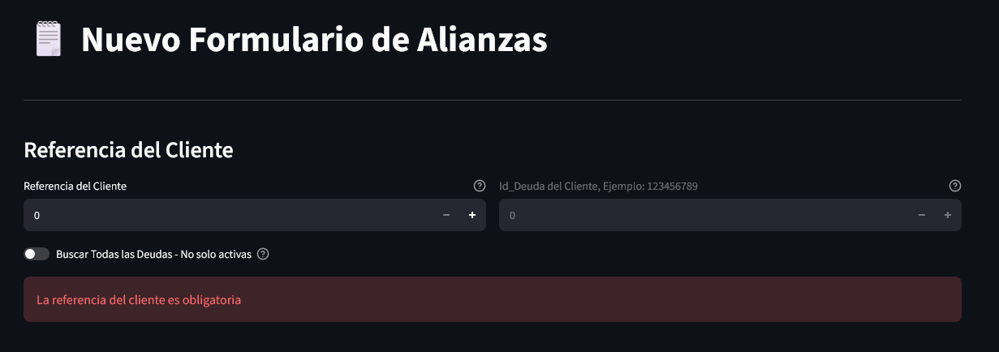

## 1.2 Paso 2: Búsqueda y validación de las deudas

Después de ingresar la referencia, el sistema realiza las siguientes validaciones de forma automática:

1. **Búsqueda de deudas:** trae las deudas de la referencia según el estado del toggle (solo activas o todas). Las deudas que ya fueron **liquidadas** se excluyen automáticamente de la lista.
2. **Si la referencia no arroja deudas:** el sistema habilita el campo **Id_Deuda** para que el negociador ingrese el identificador de alguna deuda del cliente. Con ese Id_Deuda el sistema recupera la referencia correcta y vuelve a buscar las deudas. Esto es útil cuando la referencia del cliente cambió o no se encuentra.
3. **Verificación de actualización:** se muestra un mensaje con la **"Última Actualización de las Deudas Activas"** (fecha y días hábiles transcurridos). Si la última actualización de las deudas del cliente supera el mínimo de días hábiles permitido, el formulario se bloquea con un aviso: es necesario **actualizar las deudas del cliente** antes de poder continuar. Se ofrece un botón **"Reintentar"** para volver a verificar después de realizar la actualización.
4. **Addendums:** si el cliente tiene addendums activos, estos se agregan automáticamente a la lista de deudas para poder incluirlos en la selección.

## 1.3 Paso 3: Características del Cliente

En un expander llamado **"Características del Cliente"** se muestra información del cliente obtenida de SALDOS:

- **Saldo del Cliente**: editable (se puede ajustar manualmente si es necesario).
- **Por Cobrar del Cliente**: editable (se puede ajustar manualmente si es necesario).
- **Pricing del Cliente**: solo lectura, se calcula a partir de la base de datos.

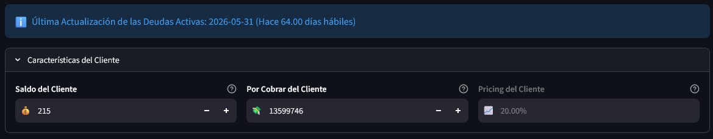

## 1.4 Paso 4: Selección de deudas

En la sección **"Selección de Deudas Activas"** se listan todas las deudas encontradas del cliente en una tabla con las columnas:

- **Seleccionar** (toggle por deuda)
- **Id Deuda**
- **Banco**
- **Deuda Bravo** (valor PaB_Origen)

Se pueden seleccionar **una o varias deudas** de forma independiente. Adicionalmente, hay dos botones de ayuda:

- **"Seleccionar Todas"**: marca todas las deudas.
- **"Deseleccionar Todas"**: desmarca todas las deudas.

Es obligatorio seleccionar **al menos una deuda** para poder continuar.

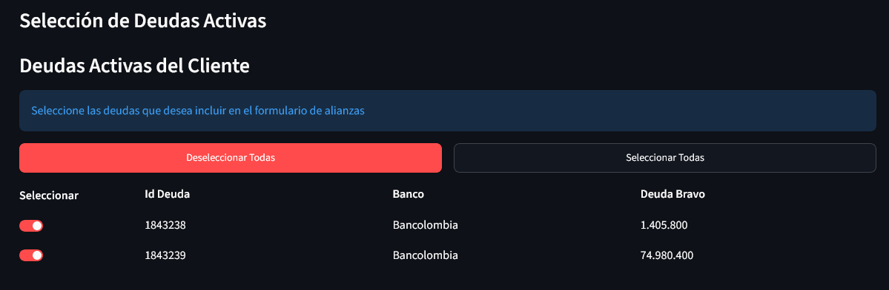

## 1.5 Paso 5: Tipo de Solicitud y Aliado

Esta sección define el objetivo de la solicitud:

- **Tipo de Solicitud** (selección única):
  - **Validación**: averiguar descuento y/o casa de cobro.
  - **Acuerdo de Pago**: negociar un acuerdo de pago con el cliente.
  - **Oferta de Acuerdo**: ofertar un valor de pago; si se acepta, se genera un acuerdo de pago.
- **Aliado - Casa de Cobro**: lista desplegable con los aliados disponibles para la solicitud.

Ambos campos son obligatorios para continuar.

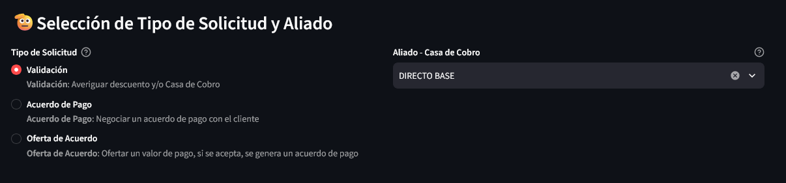

## 1.6 Paso 6: Montos propuestos por deuda

En la sección **"Montos Propuestos por Deuda"** se define el valor a solicitar por cada deuda seleccionada:

- **Monto Total a Pagar**: monto global de la solicitud. Por defecto se calcula como el 70% de la suma de las deudas seleccionadas.
- **Toggle "Distribuir el Monto entre Deudas"** (activado por defecto): si está activo, el Monto Total se distribuye automáticamente entre las deudas según el porcentaje de participación (% Total) de cada una. Si se desactiva, el negociador puede **editar el monto de cada deuda de forma individual** y el total se recalcula como la suma de los montos individuales.
- **Habilitar Solicitud a Cuotas**:
  - **No**: la solicitud se hace sin cuotas (cada deuda queda en 1 cuota).
  - **Por Deuda**: se habilita una columna para definir el número de cuotas (1 a 60) de cada deuda.
  - **Para Todas las Deudas**: se define un único número de cuotas (1 a 60) que aplica a todas las deudas.

La tabla muestra por deuda: **Id Deuda**, **Deuda Bravo** (valor original), **Descuento en Base** (si existe), **% Total** (participación de la deuda) y **Monto Propuesto** (editable cuando la distribución está desactivada).

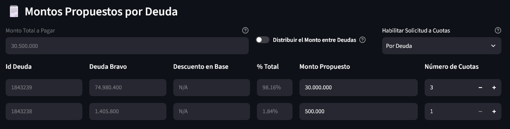

## 1.7 Monto recomendado

Para los tipos de solicitud **Validación** y **Oferta de Acuerdo**, el sistema muestra la sección **"Monto Recomendado para la Solicitud"**, que sugiere un monto con su **Descuento Óptimo** y el **Tipo de Pago** sugerido (Tradicional o Crédito - PaB Ideal). Si no hay ahorro suficiente para recomendar un monto, se muestra el mensaje "No hay Recomendación de Monto, falta ahorro".

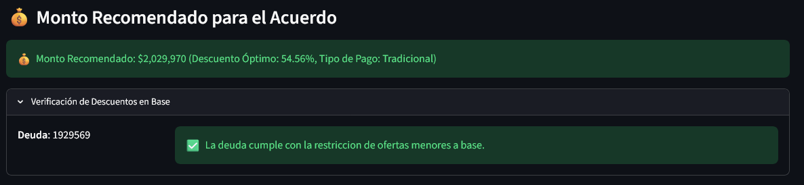

## 1.8 Alertas y verificaciones

Antes de llegar al resumen, el sistema muestra alertas que conviene revisar antes de enviar:

- **Descuento máximo del aliado**: si el aliado seleccionado brinda descuento máximo, se advierte que una oferta de mejora de descuento puede no ser aceptada.
- **Pago obligatorio en Validación**: si el aliado lo exige, se advierte que la validación requiere pago obligatorio.
- **Cuotas no soportadas**: si la solicitud es a cuotas pero el aliado no maneja cuotas, se muestra una advertencia.
- **Verificación de Descuentos en Base**: en un expander se valida deuda por deuda que el monto propuesto no supere el descuento en base existente (individual o de portafolio). Si alguna deuda no cumple, la solicitud no se puede enviar.
- **Montos inválidos**: ninguna deuda puede tener monto propuesto igual o menor a 0.

## 1.9 Paso 7: Especificaciones del Acuerdo de Pago

Esta sección solo aparece cuando el Tipo de Solicitud es **Acuerdo de Pago** u **Oferta de Acuerdo**:

- **Fecha Esperada de Pago**: la fecha en la que se esperaría realizar el pago de la deuda. Por defecto es hoy y **no puede ser anterior** a la fecha actual.
- **Tipo de Pago**: depende de si la solicitud es a cuotas o no:
  - Solicitud **a cuotas**: `Estructurado`  o `Refi`.
  - Solicitud **sin cuotas**: `Tradicional` o `Crédito`.

Ambos campos son obligatorios para continuar.

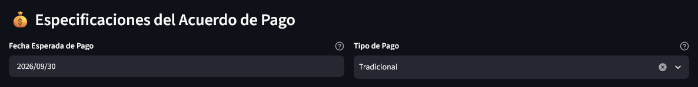

## 1.10 Comentarios adicionales

Campo de texto libre opcional **"Comentarios Adicionales sobre la Solicitud"**, donde el negociador puede incluir cualquier aclaración para el área de alianzas (por ejemplo: "Validar Máximo Descuento"). Este comentario es visible para el ejecutivo que gestiona la solicitud.

## 1.11 Paso 8: Resumen y envío de la solicitud

Al final del formulario se muestra un expander **"Ver Resumen de la Solicitud"** con toda la información antes de enviar:

- Referencia del cliente.
- Tabla de deudas con Monto Propuesto y Número de Cuotas por deuda.
- Tipo de Solicitud y Aliado.
- Monto Total de la Solicitud y Descuento Total resultante.
- Si aplica, Detalles de Pago (Fecha Esperada de Pago y Tipo de Pago).
- Comentario de la solicitud.

Finalmente, el botón **"Enviar Formulario"**:

- La solicitud **solo se puede enviar una vez** por referencia y combinación de deudas.
- Al enviar con éxito se muestra una notificación con el **ID de Solicitud** asignado.
- Si la misma referencia con las mismas deudas ya fue enviada, el botón queda **deshabilitado** con el mensaje "Esta referencia ya fue enviada previamente con esas deudas."

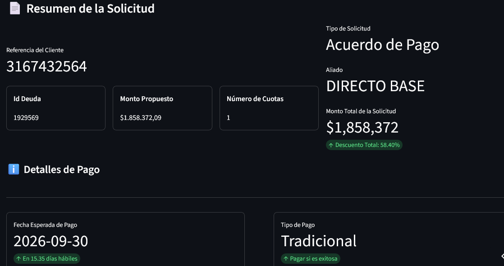

---

# 2. Vista de Respuestas (Ver Mis Solicitudes)

La página **"Ver Mis Solicitudes"** permite consultar el estado y las respuestas de las solicitudes enviadas. Solo se muestran las solicitudes **del negociador actual** (mes en curso).

La vista tiene dos pestañas:

- **"Ver Solicitudes"**: lista de solicitudes con filtros (se aborda en este documento).
- **"Resumen de Solicitudes"**: dashboard de indicadores (no se aborda en este documento).

## 2.1 Filtros

Los filtros permiten ubicar a un cliente o buscar solicitudes específicas. Están organizados en dos bloques y aplican sobre las pestañas de la vista.

### Filtros generales (5 columnas)

1. **Nombre del Cliente**: filtra por el nombre del cliente de la solicitud.
2. **Tipo de Solicitud** (Validación, Acuerdo de Pago, Oferta de Acuerdo), más el toggle **"Requiere Aprobación"**, que deja únicamente las solicitudes que están en estado de aprobación.
3. **Estado de Solicitud**, más el toggle **"Exitosas"**, que deja únicamente las solicitudes exitosas.
4. **Aliado - Casa de Cobro**, más el toggle **"Ordenar de Primera a Última"**, que invierte el orden por fecha (las más recientes primero).
5. **Estado de Liquidación** (Sin Liquidar, Liquidado Parcial, Liquidado Total, N/A), más el toggle **"Reasignable"**.

**REASIGNABLE:** En estos momentos todas las solicitudes bajo esta etiqueta son acuerdos de pago caídos que buscan una segunda oportunidad de ser liquidados

### Filtros específicos (expander "Filtros Específicos")

- **ID de Solicitud**: busca una solicitud por su ID exacto.
- **Persona que Solicita**: filtra por el correo de quien realizó la solicitud.
- **Referencia**: filtra por la referencia del cliente.
- **ID de Deuda** (selección múltiple): filtra las solicitudes que incluyan los IDs de deuda seleccionados.
- **Banco** (selección múltiple): filtra por el banco de las deudas incluidas.
- **Fecha Mínima (Timestamp)**: solicitudes creadas desde esta fecha.
- **Fecha Máxima (Timestamp)**: solicitudes creadas hasta esta fecha.

### Otras consideraciones de los filtros

- Si después de aplicar los filtros no hay resultados, se muestra un aviso y el botón **"Reiniciar Filtros"**.
- Al final de la página también existe un botón **"Reiniciar Filtros"** para limpiar todas las selecciones.

## 2.2 Vista de solicitudes paginadas

Las solicitudes filtradas se muestran en **páginas**, cada una en un expander propio. Los controles de paginación están al final de la lista:

- **Registros por página**: selector con opciones **10, 20, 30 o 40** solicitudes por página.
- **Página Actual**: campo numérico para saltar directamente a una página.
- **Botones de navegación** (máximo 5): ir al inicio (`<<`), página anterior, página actual (resaltada), página siguiente e ir al final (`>>`).
- **Indicador de avance**: un texto muestra "Mostrando X-Y de Z Solicitudes. (P%, N páginas en total)".

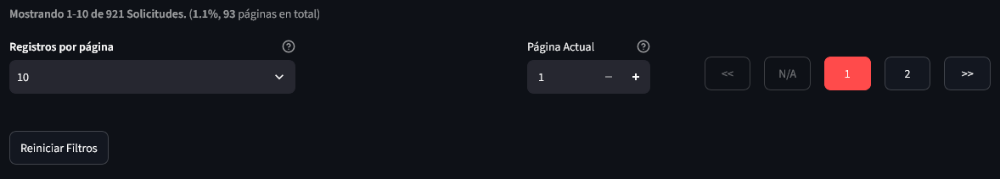

## 2.3 Contenido de cada solicitud (expander)

Cada solicitud es un expander cuyo **encabezado** resume la solicitud: ID, Tipo de Solicitud, Aliado, Fecha de creación y Estado. Además, se agregan **etiquetas de color** según el estado:

- **Violeta**: subestado transitorio de la solicitud ("Pendiente de Confirmación", "Petición Denegada" o "Petición Aceptada" para los estados Bajo Comité o Titular Ilocalizable).
- **Verde**: "Solicitud Aprobada" (estado Exitosa).
- **Azul**: "Solicitado a Aliado" (estado Solicitado).
- **Naranja**: "Sin Gestionar" (estado Sin Tocar).
- **Rojo**: "Solicitud Rechazada" (otros estados no exitosos).
- **Gris**: nombre del cliente.
- **Color según liquidación**: Sin Liquidar (rojo), Liquidado Parcial (amarillo), Liquidado Total (verde).
- **Naranja "REASIGNABLE"**: cuando la solicitud es un acuerdo caído reasignable.

### Datos principales (métricas)

Al expandir la solicitud se muestran cuatro métricas:

- **Referencia**: con la cédula del cliente.
- **Monto Total**: suma de los montos propuestos, con el porcentaje de descuento frente al monto original.
- **Ejecutivo**: el ejecutivo que atiende la solicitud (o "Sin Asignar").
- **Fecha de Solicitud**: fecha y hora de creación, con los días transcurridos.

Además:

- **Comentario del Negociador** (si fue registrado).
- Para **Acuerdo de Pago** y **Oferta de Acuerdo**: métricas de **Fecha de Pago** (con días hábiles restantes o retraso) y **Tipo de Pago**.
- Expander **"Detalles de la Solicitud por Deuda"**: por cada deuda se muestra Id Deuda, Banco, Número de Crédito, Descuentos en Base (popover), Monto Propuesto y Número de Cuotas.

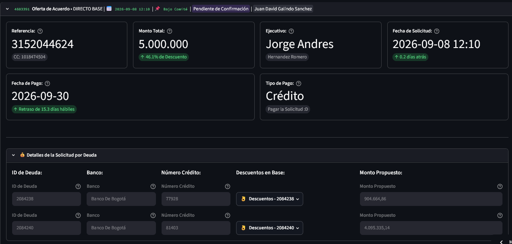

### Según el estado, la solicitud muestra además

- **Si requiere aprobación**: se muestra el comentario del ejecutivo, el tipo de aprobación requerida, un campo de comentario y los botones **"Aprobar Solicitud"** / **"Desaprobar Solicitud"**. Mientras no se apruebe o desapruebe, la solicitud no continúa.

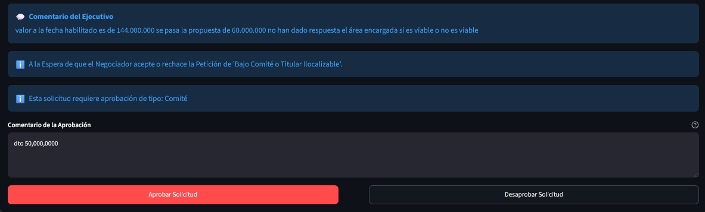

- **Si aún no ha sido respondida**: un mensaje informativo indicando que se debe esperar a que un ejecutivo la gestione.
- **Si ya fue respondida**: la sección **"Información de la Respuesta a la Solicitud"** con:
  - Fecha de Respuesta, Estado de Solicitud y (si fue exitosa) Monto Respuesta con su descuento.
  - Comentario del Ejecutivo.
  - Indicador de si el cliente fue actualizado recientemente por el negociador.
  - Expander **"Detalles de la Respuesta por Deuda"**: compara por deuda el Monto Solicitado vs. el Monto Respuesta (y cuotas si aplica).
  - **Fecha Límite de Pago**, **Pago Total Obligatorio** (sí/no) y **Método de Pago** (cuando no es Validación).

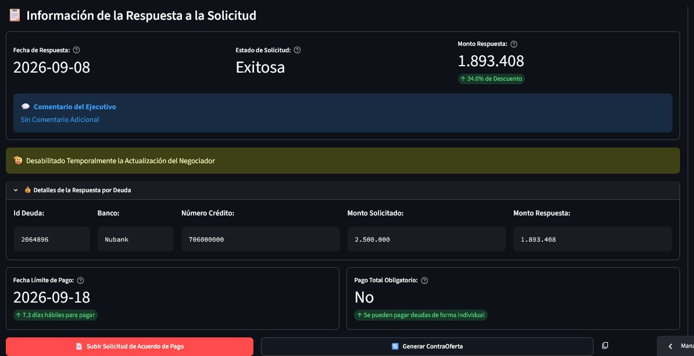

### Acciones sobre solicitudes exitosas

- **Acuerdo de Pago / Oferta de Acuerdo**: botón **"Ver Acuerdo de Pago"** (abre el PDF del acuerdo) y botón para copiar el resultado de la solicitud.
- **Validación**: si el ejecutivo la catalogó como máximo descuento, se muestra la alerta correspondiente. Además están los botones **"Subir Solicitud de Acuerdo de Pago"** (para convertir la validación en un acuerdo) y **"Generar ContraOferta"** (para ajustar la oferta), junto con el botón para copiar el resultado.
- **Copiar Resultado**: Botón para copiar el resultado de la solicitud a modo de mensaje 

---

# 3. Glosario de Estados de Solicitud

| Estado | Descripción |
| --- | --- |
| **Sin Tocar** | La solicitud no ha sido gestionada por un ejecutivo. |
| **Solicitado** | La solicitud fue escalada al aliado. |
| **Exitosa** | La solicitud fue respondida y finalizada con éxito. |
| **No Exitosa** | La solicitud fue validada pero no tuvo éxito. |
| **Errónea** | La solicitud fue subida con datos erróneos o incompletos. |
| **Vencida** | La solicitud no fue gestionada dentro del plazo de días hábiles establecido. |
| **Bajo Comité** | Estado transitorio: la solicitud debe ir a comité para seguir escalando. |
| **Titular Ilocalizable** | Estado transitorio: no se puede continuar hasta localizar al titular de la deuda. |
| **No está con Aliado** | La solicitud fue brindada con un aliado pero el cliente no se encuentra con el mismo. |
| **Validada por Fuera** | Hubo una validación y/o pago por fuera para las deudas. |

| Estado de Liquidación | Descripción |
| --- | --- |
| **Sin Liquidar** | Ninguna deuda de la solicitud ha sido liquidada. |
| **Liquidado Parcial** | Solo una parte de las deudas fue liquidada. |
| **Liquidado Total** | Todas las deudas fueron liquidadas. |
| **N/A** | No aplica / no es solicitud exitosa. |
